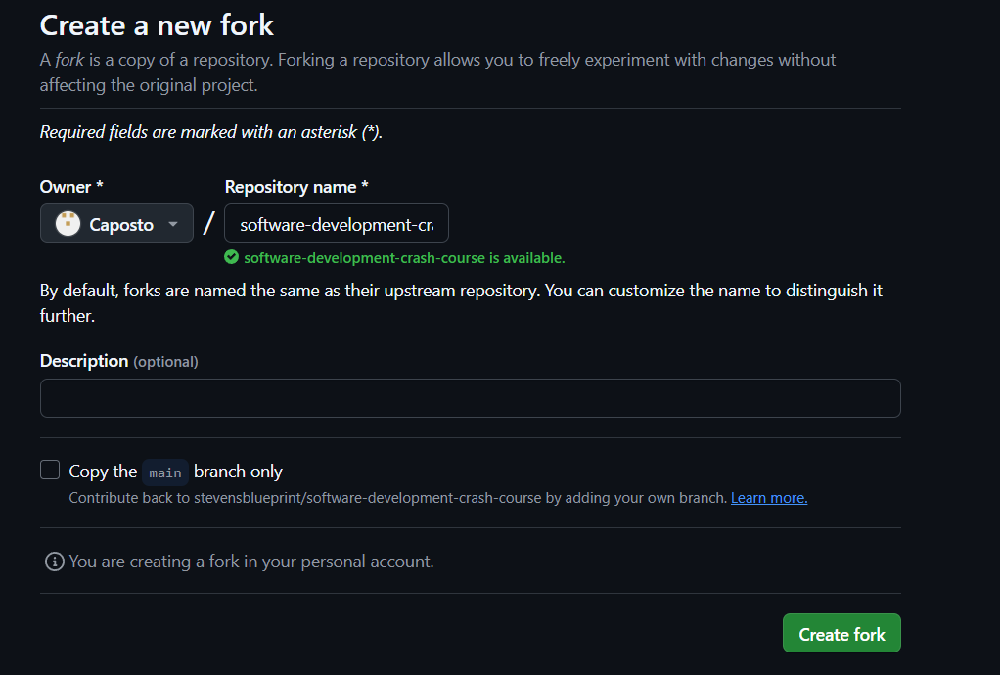

# Software Development Crash Course

The goal of this workshop is to help you improve how you develop Software both independently, but especially as a TEAM. We are using a very simple Flask/Python web app to illustrate the concepts we will be discussing. The focus is not on writing the code itself, but on the process of developing the code.

## Prerequisites

- Have Python installed on your machine
- Have git installed on your machine and have a GitHub account

## Getting Started

1. Fork this repository



If you would like a challenge, uncheck the option to "Copy the main branch only". We have additional a barebones branch calleed "hard-mode" that you can use to start from scratch.

2. Clone the forked repository to your machine:

`git clone git@github.com:YOUR_USERNAME/software-development-crash-course.git`

3. Create and activate a virtual environment:

`python3 -m venv venv`

`source venv/bin/activate` This may vary depending on your OS

4. Install the dependencies

`pip install -r requirements.txt`

5. Run the project

`python src/app.py`

You are now ready to implement the GitHub actions for linting/formatting and testing.

### Setting up Linting/Formatter

To run the formatter
```bash
black src/
```

To run the linter
```bash
pylint src/
```

**Note:** Make sure you have your virtual environment activated and you have installed all the dependencies from `requirements.txt`.

### Writing Tests with Pytest

To run the unit tests
```bash
python3 -m unittest test/test.py
```

You will get a summary of all the passed unit test cases. 

### Automating the Linting Checks and Tests with GitHub Actions
We want to make sure that on every pull request and push to main, we mantain the same coding standards.
To achieve this, GitHub has Github Actions. GitHub Actions is a CI/CD service that allows us to automate 
tasks within your software development lifecycle. It enables us to build, test, and deploy your code directly from GitHub.